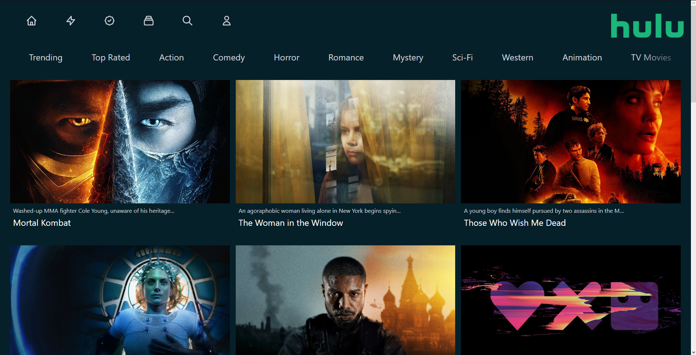

# Hulu Clone

A Hulu clone using [Next JS](https://nextjs.org), [Tailwind CSS](https://tailwindcss.com) & [Heroicons](https://heroicons.com) for the front-end and [TMDB](https://www.themoviedb.org) API for the data. Inspired by [this tutorial](https://www.youtube.com/watch?v=MqDlsjc8GLo&t=2151s).

## Requirements

Assuming you have [npm](shttps://www.npmjs.com) or [yarn](https://www.yarnpkg.com) installed, clone the repo and run the following code:

```
npm install

or

yarn install
```

## Usage

Inside the cloned folder run:

```
npm run dev

or

yarn dev
```

## Example

<p align="center">
   
</p>
